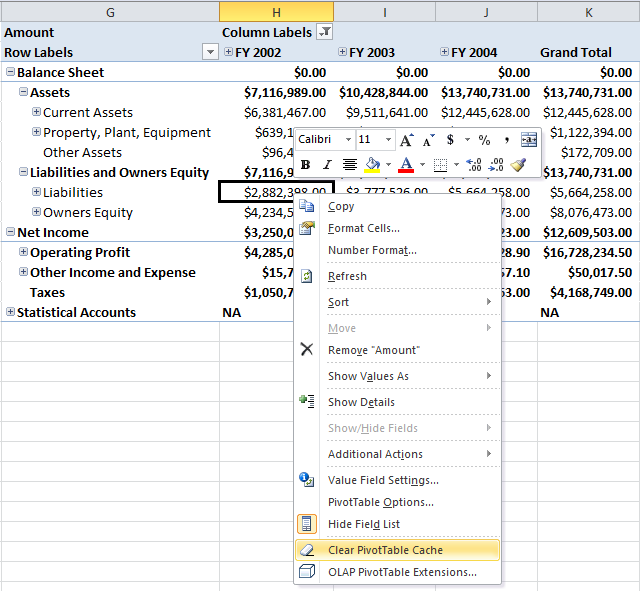

### Clear PivotTable Cache

If you have built a PivotTable with sensitive financial information, and you want to pass it along to colleagues, the cube may define role based security such that each colleague is allowed to see a different portion of the financial statement. Unfortunately, when you email an Excel workbook with a PivotTable, you are emailing both the cached PivotTable view you last saw and a connected PivotTable that can be refreshed under your coleague's permissions. The cached data may be a security breach.

Starting with OLAP PivotTable Extensions version 0.7.2, the "Clear PivotTable Cache" feature addresses this problem. It allows you to blank out all the cached data in the PivotTable before you send out the Excel workbook. Right click on the PivotTable and choose this command:

The PivotTable will then refresh and end up blank. Then save the workbook and distribute it. When the recipient opens up the workbook and refreshes it, the PivotTable will have data again.

#### How This is Done Technically

Behind the scenes, OLAP PivotTable Extensions is running the following MDX script statement on the connection for that one PivotTable. This statement temporarily nulls out the entire cube, only for your connection. Once this statement is run, the PivotTable is refreshed which blanks out the visible data.

{"[Measures](Measures).AllMembers = null;"}

This type of statement is only supported by Analysis Services 2005 and later.

Be sure to save the workbook before running this command in case something goes wrong.