**OLAP PivotTable Extensions** is an Excel add-in which extends the functionality of PivotTables on Analysis Services cubes. The Excel API has certain PivotTable functionality which is not exposed in the UI. OLAP PivotTable Extensions provides an interface for some of this functionality. It also adds some new features like searching cubes, configuring default settings, and filtering to a list in your clipboard. The add-in can be launched from the following menu option in the right-click menu for PivotTables:

This page is currently under construction. The current home page for [OLAP PivotTable Extensions](http://olappivottableextend.codeplex.com/) is still on Codeplex. Please be patient as we migrate to Github.

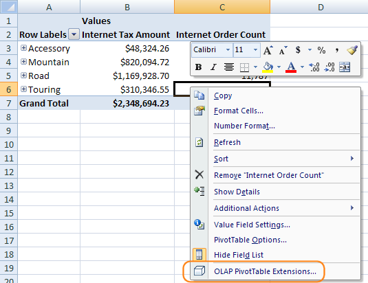

#### Private Calculated Members

Any calculated members which are part of the Analysis Service cube on the server can be added to PivotTables. But there is no built-in UI to define your own MDX calculations. Adding extra Excel calculations in the cells surrounding the PivotTable has some limitations as they are not part of the PivotTable and can be wiped out if the dimensions of the PivotTable change, and plain Excel calculations must only operate on data visible in the PivotTable.

OLAP PivotTable Extensions let you define your own calculated measures which are private to that particular PivotTable:
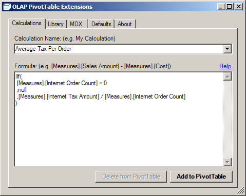

Those calculations appear in the PivotTable just like any other calculations:
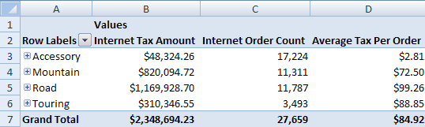

They appear in the Field List pane at the very top under the Values grouping:
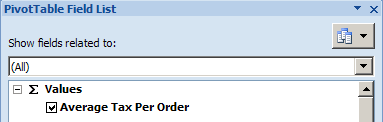

For help with advanced calculation properties for these private PivotTable calculations, or for help with MDX expressions, refer to our [Calculations Help](Calculations-Help) page.

Thankfully, in [Excel 2013](Excel-2013) Microsoft does provide a [UI for building MDX calculations](Excel-2013) for the first time. It even includes a drag and drop field and function list. So use OLAP PivotTable Extensions in Excel 2013 for some of the other features it offers, which are detailed below. Unfortunately, Excel 2013 removed support for adding MDX calculated measures to PivotTables on Power Pivot models.

**Best Practice:** In order to ensure a single version of the truth, it is a best practice to define important calculations as part of the cube source code. But some calculations like simple ratios or differences may clutter the cube and may be more appropriate if defined in the PivotTable itself. In addition, certain ad hoc research or prototyping may be more appropriate to be done as calculations private to a PivotTable until they are finalized and are ready to be added to the cube source code.

#### Calculations Library

Since all calculations you define are private to that one PivotTable, OLAP PivotTable Extensions automatically creates a Calculations Library for you which contains all the calculations you create. This allows you to pick any previous calculation you've used from a dropdown and add it to the current PivotTable:

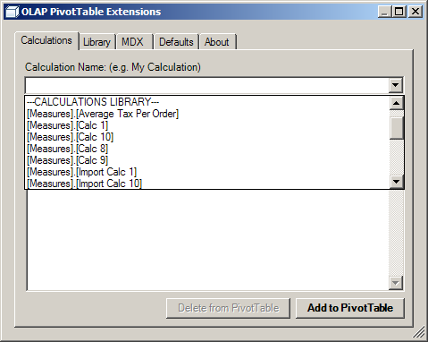

You can also perform Calculation Library maintenance by importing, exporting, and deleting calculations:

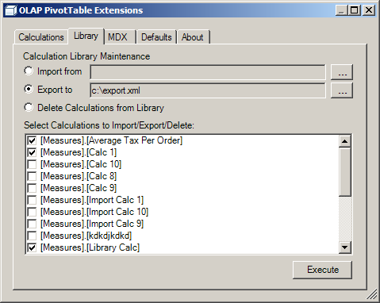

#### View PivotTable MDX

If a PivotTable is performing poorly or returning incorrect numbers, it may be necessary for the Analysis Services administrator to troubleshoot the MDX query which the PivotTable is using. The MDX tab of the OLAP PivotTable Extensions dialog shows you this MDX.

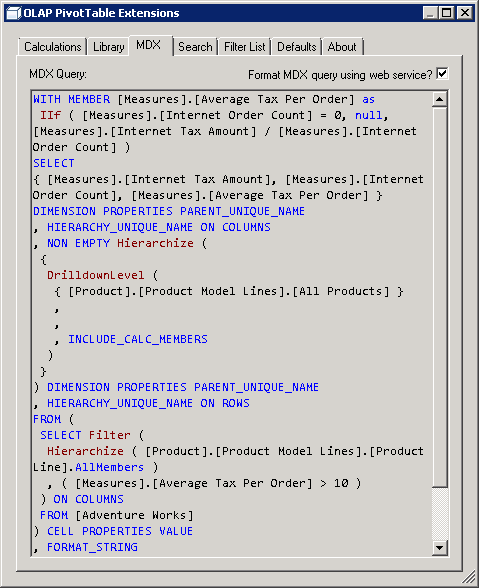

Starting with release 0.7.3, you can check the checkbox in the top right in order to send your MDX query to a [web service](http://blogs.msdn.com/b/business_intelligence_labs/archive/2011/09/13/format-mdx-amp-dax-web-service-for-formatting-is-available.aspx) for formatting, thanks to Nick Medveditskov.

The MDX is exactly what is sent to the server with one exception. Any private calculations you've created for your PivotTable are defined as session calculated members. The MDX query exposed on the MDX tab displays the formulas for these calculations as query calculated members in the WITH clause of the MDX query. This allows an administrator to copy and paste the MDX query and troubleshoot it more easily in Management Studio or [MDX Studio](http://www.ssas-info.com/forum/viewforum.php?f=3).

#### Filtering PivotTable to a List

A common scenario is having a list of items you wish to research in a PivotTable. Instead of manually checking each item in the filter dropdown, you can use the [Filter List](Filter-List) feature from OLAP PivotTable Extensions:

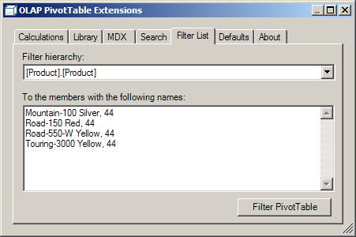

#### Changing PivotTable Defaults

Certain settings must be manually changed after creating a new PivotTable. For instance, if your dimensions have calculated members you wish to see in your PivotTable, you must manually right click on the PivotTable, choose PivotTable Options, flip to the Display tab, then check "Show calculated members from OLAP server". The Defaults tab of OLAP PivotTable Extensions lets you default this setting to be on in any new PivotTables you create in the future. If checked, it also automatically sets "Refresh data when opening the file" on the connection properties:

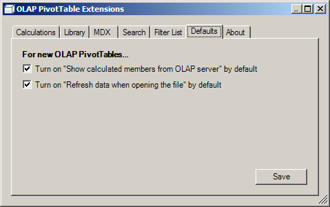

Note that Excel 2016 added a [new options screen](https://support.office.com/en-us/article/Set-PivotTable-default-layout-options-efd8569c-f07a-43c1-9db2-4f2912a0f94e) where you can set many more PivotTable formatting and functional defaults.

#### Searching

Finding what you’re looking for in a cube can sometimes be challenging, but the Search feature of OLAP PivotTable Extensions can help. It lets you text search the items in the Field List and their descriptions. It also lets you text search the dimension members in your cube.

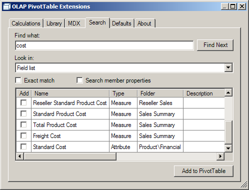

For more detailed information about the Search feature, see the dedicated [Search](Search) page.

#### Distributing PivotTables

OLAP PivotTable Extensions need only be installed on computers which need to create new private PivotTable calculations. After those calculations have been defined, the PivotTable can be distributed to others without problem. If you distribute the Excel workbook to other Excel users, they will be able to continue designing and manipulating that PivotTable without problem. If published to Excel Services, the private calculations you define will still be active in the PivotTable.

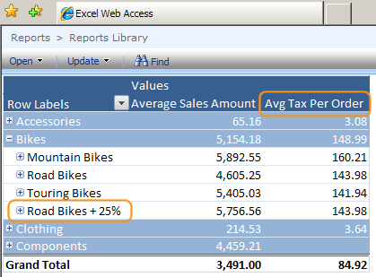

The Calculation Library does not need to be distributed unless other users wish to start brand new PivotTables and reuse certain calculations you have created using OLAP PivotTable Extensions.

Using Excel 2007/2010/2013/2016 and OLAP PivotTable Extensions to edit an Excel 2003 format .xls workbook with a PivotTable and add a private calculated member will work. This PivotTable can be saved and distributed to users of Excel 2003 and the private calculated member will show up and work.

#### Other Features

Other features include:

* [Clear PivotTable Cache](Clear-PivotTable-Cache)
* [Show Property as Caption](Show-Property-as-Caption)
* [About Tab](About-Tab)
* [View #VALUE! Error Message](View-Error-Message)
* [Disable Auto Refresh](Disable-Auto-Refresh)
* [Choose Fields to Show](Choose-Fields-to-Show)

The following features are supported by version of Excel:

|| Feature || Excel 2007 || Excel 2010 || [Excel 2013](Excel-2013)(Excel-2013) OLAP || [Excel 2013](Excel-2013)(Excel-2013) Power Pivot || Excel 2016 OLAP || Excel 2016 Power Pivot ||
| MDX Private Calculated Members | X | X | X |  | X |  |
| View PivotTable MDX | X | X | X | X | X | X |
| [Filter PivotTable to a List](Filter-List) | X | X | X | X | X | X |
| [Search](Search) | X | X | X | X | X | X |
| Change PivotTable Defaults | X | X | X |  | X |  |
| [Clear PivotTable Cache](Clear-PivotTable-Cache) | X | X | X |  | X |  | 
| [Show Property as Caption](Show-Property-as-Caption) | X | X | X |  | X |  |
| [About Tab](About-Tab) | X | X | X | X | X | X |
| [Upgrade PivotTable](About-Tab) | X | X | X | X | X | X |
| [View #VALUE! Error Message](View-Error-Message) | X | X | X |  | X |  |
| [Disable Auto Refresh](Disable-Auto-Refresh) | | | | X |  | X |
| [Choose Fields to Show](Choose-Fields-to-Show) | X | X | X | X | X | X |

#### Installation Requirements

* Excel 2013 or Excel 2016 is required.
	* For older versions, see the [last release to support Excel 2007 and Excel 2010](https://github.com/OlapPivotTableExtensions/OlapPivotTableExtensions/releases/tag/v0.8.4).
* Access to a cube on an Analysis Services server or to the built in Excel Data Model (Power Pivot) is required
* NET Framework version 4.5.2 is required.
* See the [Download tab](Download tab)(http___olappivottableextend.codeplex.com_releases) for the installer

#### Troubleshooting Installation

If OLAP PivotTable Extensions is not visible in Excel, please consult the [Troubleshooting Installation](Troubleshooting-Installation) page.

#### Feedback

To report bugs or suggestions, please post an item to the [Issue Tracker](http://www.codeplex.com/OlapPivotTableExtend/WorkItem/List.aspx) tab.

To ask questions about MDX formulas such as the formulas used for private PivotTable calculations, see our [Calculations Help](Calculations-Help) page, or post a question to the [MDX tag on StackOverflow](http://stackoverflow.com/questions/tagged/mdx) or the [Microsoft Analysis Services Forum](http://social.msdn.microsoft.com/forums/en-US/sqlanalysisservices/threads/), or contact your Analysis Services administrator.

To discuss OLAP PivotTable Extensions, please start a thread on the [Discussions](http://www.codeplex.com/OlapPivotTableExtend/Thread/List.aspx) tab.

#### Updates

To keep up-to-date with future enhancements, subscribe to the [Release RSS feed](http://olappivottableextend.codeplex.com/project/feeds/rss?ProjectRSSFeed=codeplex%3a%2f%2frelease%2folappivottableextend) or to the [All Project Updates RSS feed](http://olappivottableextend.codeplex.com/project/feeds/rss).

#### Acknowledgments and Additional Information

For links to other resources about PivotTables, view our [Acknowledgments and Additional Information](Acknowledgments-and-Additional-Information) page.