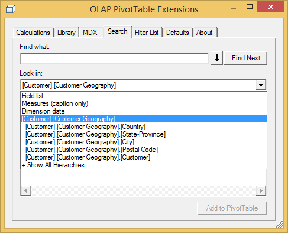

### Search

Finding what you’re looking for in a cube can sometimes be challenging, but the Search feature of OLAP PivotTable Extensions can help. It lets you text search the items in the Field List and their descriptions. It also lets you text search the dimension members in your cube.

There are 5 primary use cases for the Search feature:

#### USE CASE #1: Finding a field in the field list

Let’s say that you have been directed to cut costs company-wide. You want to research anything related to costs, so you pull up a PivotTable and begin to scroll through the enormous field list trying to find anything related to cost.

Then you install OLAP PivotTable Extensions and can text search the field list for the term “cost.” You quickly see that there are several measures showing various costs, and there is also a Standard Cost attribute of a Product. You check the ones you want and add them to the PivotTable.

Starting with release 0.8.4, the Look In dropdown also has a "Measures (caption only)" option. When Look In is set to "Field list" it will search the measure caption, display folder, measure description, and measure group caption. In some cases, such a search returns more results than desired. The "Measures (caption only)" search option lets you search only the measure captions (not folders, descriptions, or measure group captions).

Once you choose “Measures (caption only)” then it becomes the default option the next time you open the search box. (To be clear, if you right click on a dimension member on rows/columns/filters and choose Search, it defaults you to searching only that hierarchy. But if you open OLAP PivotTable Extensions from anywhere else in the PivotTable and go to the search tab, this new code defaults you to “Field list” vs. “Measures (caption only)” depending upon which one you chose last.)

#### USE CASE #2: Finding where a member resides in the tree

Let’s say that you want to slice a PivotTable to see the data for a particular employee named Kim Ralls. You have no idea who manages her so do not know where to look in the tree. (But you do know she is not very senior, so she is probably quite deep in the Employees hierarchy. In fact, she’s 4 levels deep in Adventure Works.) So you add the Employees hierarchy to the filter area, then you right-click on that hierarchy in the PivotTable and choose “Search…”

The OLAP PivotTable Extensions window pops up, it preselects that you just want to look in the Employees hierarchy, and then you search for “ralls”:

Checking Kim T. Ralls and clicking “Add to PivotTable” will set the filter to that employee.

You can also right-click on dimension hierarchies on rows or columns and search them in a similar manner. If the dimension member you find and choose to add to the PivotTable is part of a hierarchy on rows or columns, OLAP PivotTable Extensions tries to make sure that hierarchy is expanded so that the member is visible. However, in some situations, other filters or lack of fact data may cause that member to be invisible even after you click the “Add to PivotTable” button.

#### USE CASE #3: Finding which dimensions contain information about a term

Let’s say that you are the sales manager for the Northwest part of the Unites States. You are obviously interested in the Northwest, so you can search the cube’s dimensions to see what references to the northwest there are:

You see that the Sales Territory dimension and the Organization dimension both contain a member related to the Northwest. There is also a reseller with an address containing that search term.

#### USE CASE #4: Searching descriptions of fields

Unfortunately, Excel 2007/2010/2013 does not display the description property as a tooltip in the field list [like it should](http://www.artisconsulting.com/blogs/greggalloway/2009/9/22/self-documenting-cubes-in-excel-pivottables). The Search feature of OLAP PivotTable Extensions lets you search the description property of every field in the field list:

The “description” property (and the “Folder” property) is only searched when you uncheck “Exact match.”

#### USE CASE #5: Searching with multiple search terms

Starting with release 0.8.4, you can now search for multiple search terms. Though the [Filter List](Filter-List) feature allows filtering to multiple search terms with an exact match, the Search feature can be much more powerful. First, the Filter List feature only allows exact matches while the Search feature allows partial matches. Second, the Search feature allows previewing the search results and choosing the ones to add to the PivotTable.

To search for multiple search terms, press the little down arrow button next to Find Next:

At this point you may paste in a list of search terms and click Find Next:

A count of the number search items and matches displays. Any search terms which don't find any matches are highlighted red.

#### Add To Current Filters

Release 0.7.1 adds a new feature which is the ability for your search results to be added to existing filters:

This button applies when you are searching Dimension data and when the dimension member(s) you're adding come from a field that is in the Filters section of the PivotTable currently (or from a field that's not currently in the PivotTable and will thus be added to the Filters section of the PivotTable when you click "Add to PivotTable"). Checking "Add to current filters" will add the members you check to the existing members checked in that Filter field. You will end up with a multi-select. This is also helpful when you want check more than one member from the same field and want the filter to reflect a multi-select that includes all items you just checked in the Search dialog.

#### Searching Hierarchies Not In the PivotTable

Release 0.8.4 includes a way to search fields that are not currently in the PivotTable. Once you pick the "+ Show All Hierarchies" option in the Look In dialog, the Look In dropdown now shows all hierarchies in the cube, not just any hierarchy that’s already in the PivotTable.

#### Searching Just a Specific Level in a Hierarchy

As shown in the screenshot above, release 0.8.4 allows searching a specific level or a specific hierarchy. 

#### Search Speed

Cubes contain a vast amount of metadata, and dimensions can be very large, so it is good to know how expensive each type of search will be...

* **FASTEST:** Searching the Field List is the fastest search operation as it is simply searching metadata. If  you uncheck “Exact match” it also searches the Description property and the Folder property, but this does not impact performance significantly. "Measures (caption only)" always just searches the measure caption.
* **FAST:** Searching a particular hierarchy or level by choosing it out of the “Look in” dropdown, and checking “Exact match” will be very fast as it uses the hash indexes for that dimension.
* **QUICK:** Searching dimension data with “Exact match” checked and “Search member properties” unchecked is fairly quick as it uses the hash indexes for the dimensions.
* **SLOW:** Searching dimension data with “Exact match” unchecked is slow as it has to run one query per hierarchy and scan every dimension member. Dimensions are scanned in order of smallest to largest (since smaller dimensions are often used more frequently), so you may see the progress bar moving slower and slower the further it gets.
* **SLOWEST:** Searching dimension data with “Search member properties” checked is very slow as it has to run one query per hierarchy and scan every dimension member and every member property in addition to the member’s caption. Dimensions are scanned in order of the smallest to the largest.

_Warning:_ If you have ROLAP dimensions, this searching dimension data could be very slow, so it is recommended that you search individual hierarchies by picking them out of the “Look in” dropdown. Talk to your Analysis Services administrator to determine if you have any ROLAP dimensions.

#### Search Speed Optimizations

Starting with release 0.8.4, a number of search performance optimizations were implemented. Search runs a little faster than before when searching case insensitive cubes. Also, search performance is improved by detecting whether searching on the server or on the client will be quicker under current network conditions. 

_Known Issue:_ Especially when searching for multiple search terms, the performance may be better when ["Exact match" is unchecked](https://olappivottableextend.codeplex.com/workitem/25642). This will hopefully be resolved in a future release.

_Note:_ The search feature code was designed so that the [CubeSearcher class](https://github.com/OlapPivotTableExtensions/OlapPivotTableExtensions/blob/master/OlapPivotTableExtensions/CubeSearcher.cs) has no knowledge of Excel. That makes it completely standalone so it can be reused in other custom UIs. Just be sure to credit this project and post a discussion topic if you make enhancements so we can consider pushing those enhancements back into OLAP PivotTable Extensions.
