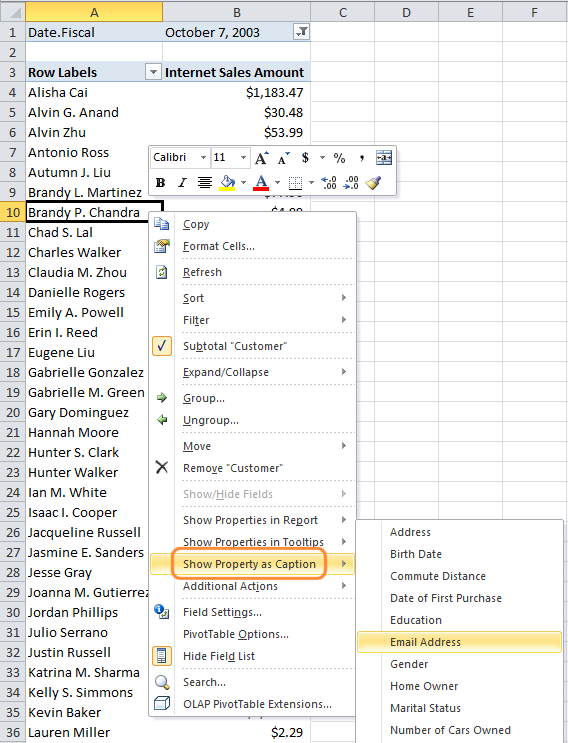
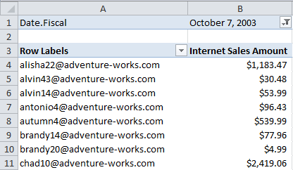

### Show Property as Caption

Starting with release 0.7.2, OLAP PivotTable Extensions adds a "Show Property as Caption" menu option. This feature puts a UI on yet another Excel feature that's available in the object model but not in the UI out-of-the-box.

#### Use Case
Let's say you have a PivotTable listing customers on rows. You can display their name, but really you want to display their email address. You could use the Excel built-in "Show Properties In Report" feature to display it in the column to the right of the customer name. But since the Email Address field in the Customer dimension of the Adventure Works sample cube is only a member property (not an attribute hierarchy you can drop onto rows), out-of-the-box you can only show it as a property to the right of customer name.

#### Instructions
Right click on a dimension member in the PivotTable and choose the following menu options...

Then the PivotTable looks like the following:

One advantage of the built-in "Show Properties In Report" feature is that the member properties come through into Excel with their proper datatypes. So a member property of datetime datatype comes across as such and can be formatted using Excel formatting. And numeric member properties come across as such and can be formatted in Excel. However, when you use any member property as a caption using the "Show Property as Caption" OLAP PivotTable Extensions feature, the caption comes across as a string and cannot be formatted in Excel, unfortunately.