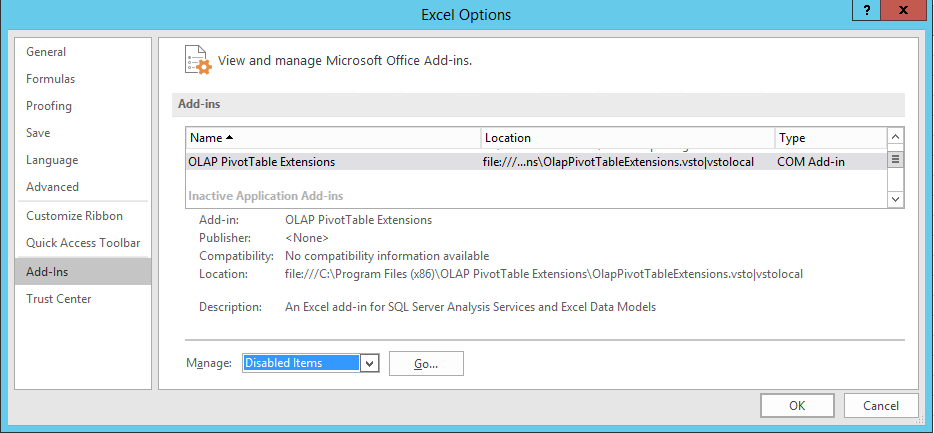
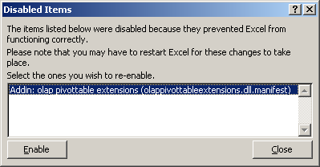
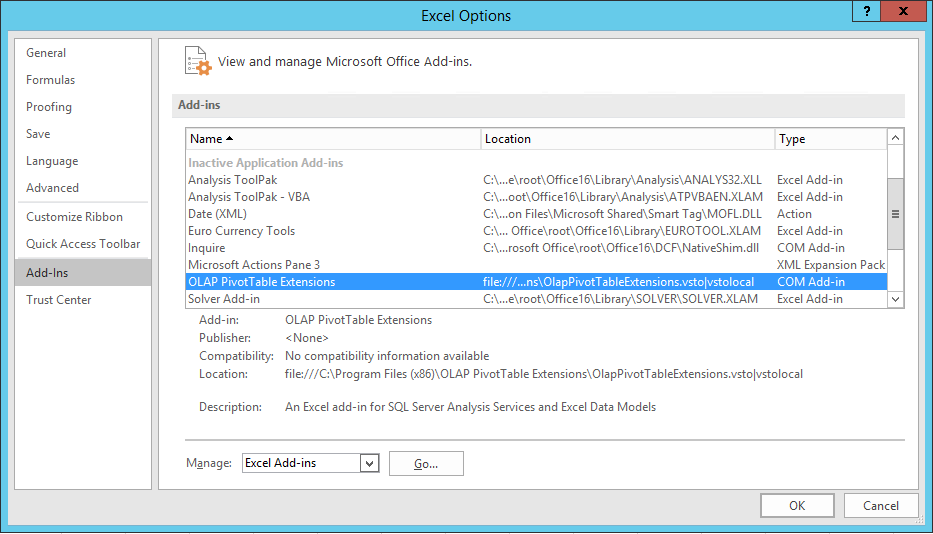
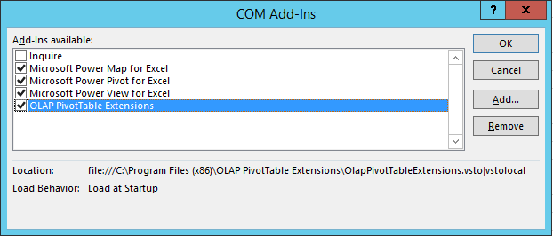

### Troubleshooting Installation

This page is the guide for troubleshooting installation issues with OLAP PivotTable Extensions.

**Restarting Excel After Installation**

The first thing to try is to restart Excel. If you install OLAP PivotTable Extensions while Excel is open, it must be restarted. Close all Excel documents and close Excel. Then open Excel again to see if that solves the problem.

**Is Your PivotTable an OLAP PivotTable?**

If you click on the PivotTable then press Alt-F11 then Ctrl-G then paste the following into the Immediate window and press enter:

?ActiveCell.PivotTable.PivotCache().OLAP

Does it say True?

If not, then you PivotTable is a native PivotTable that's summarizing some table or other data in the spreadsheet or SQL table. You have to have an OLAP PivotTable (that is, one connected to an Analysis Services server) for my add-in to work.

**Repairing the OLAP PivotTable Extensions Installation**

Starting with Release 0.7.0, the installer should fix all of the issues listed below. (Update: Release 0.9.0 does not yet properly repair all of these problems listed below.) So if OLAP PivotTable Extensions is not working, try to repair the installation as follows, and that should fix the problem.

On Windows XP, go to Start... Settings... Control Panel... Add or Remove Programs. Click on OLAP PivotTable Extensions and click Change, on the next screen choose to Repair OLAP PivotTable Extensions, and click Finish.

On Windows 2003, go to Start... Control Panel... Add or Remove Programs. Click on OLAP PivotTable Extensions and click Change, on the next screen choose to Repair OLAP PivotTable Extensions, and click Finish.

On Windows Vista or Windows 2008, go to Start... Control Panel... Classic View... Programs and Features. Right click on OLAP PivotTable Extensions and click Change, on the next screen choose to Repair OLAP PivotTable Extensions, and click Finish.

On Windows 7, go to Start... Control Panel... Uninstall a program. Right click on OLAP PivotTable Extensions and click Change, on the next screen choose to Repair OLAP PivotTable Extensions, and click Finish.

**Manual Troubleshooting**

If you prefer to troubleshoot the installation manually, then use the following information and screenshots.

**Is It Disabled?**

The first thing to check is whether OLAP PivotTable Extensions is disabled. Click on the File button (in the top left) and choose Options. Click on the add-ins tab, then scroll down and see if OLAP PivotTable Extensions is disabled:

If it is disabled, then select "Disabled Items" from the Manage dropdown at the bottom and click Go. Then enable the add-in using this dialog:

Then check whether the add-in is inactive using the following instructions.

**Is It Inactive?**

Then check whether OLAP PivotTable Extensions is inactive. Click on the Office button (in the top left in Excel) and choose Excel Options. Click on the add-ins tab, then scroll down and see if OLAP PivotTable extensions is in the inactive list:

If it is inactive, then select "COM Add-ins" from the Manage dropdown at the bottom and click Go. Then check OLAP PivotTable Extensions and click OK.

Then repeat the instructions above making sure it is now active, not inactive.

